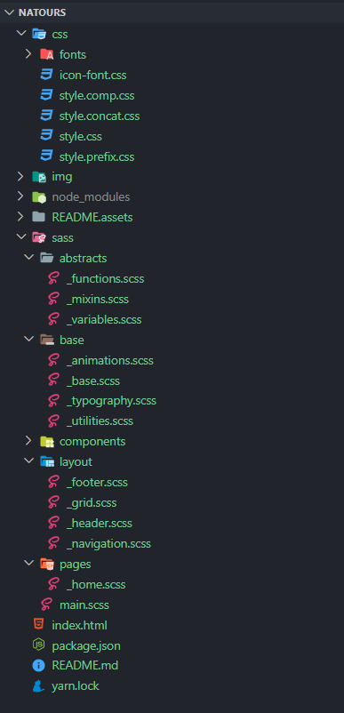
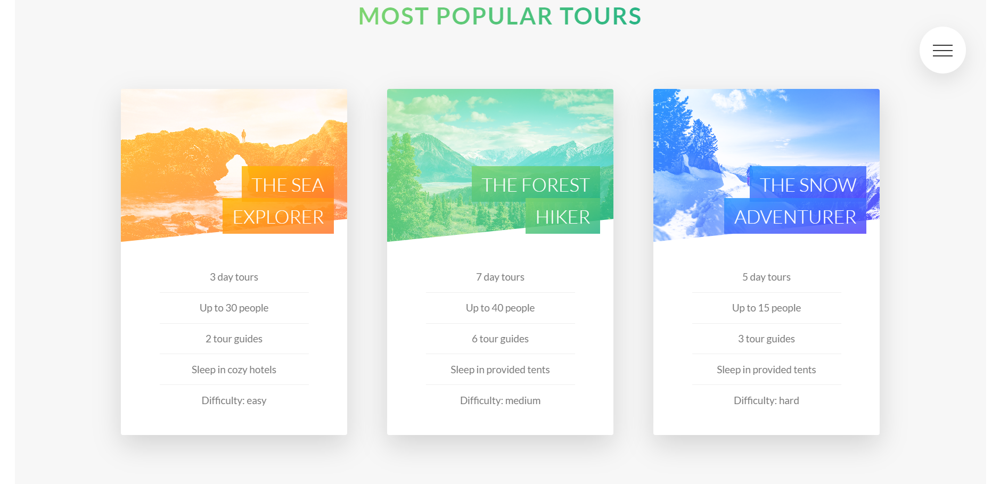
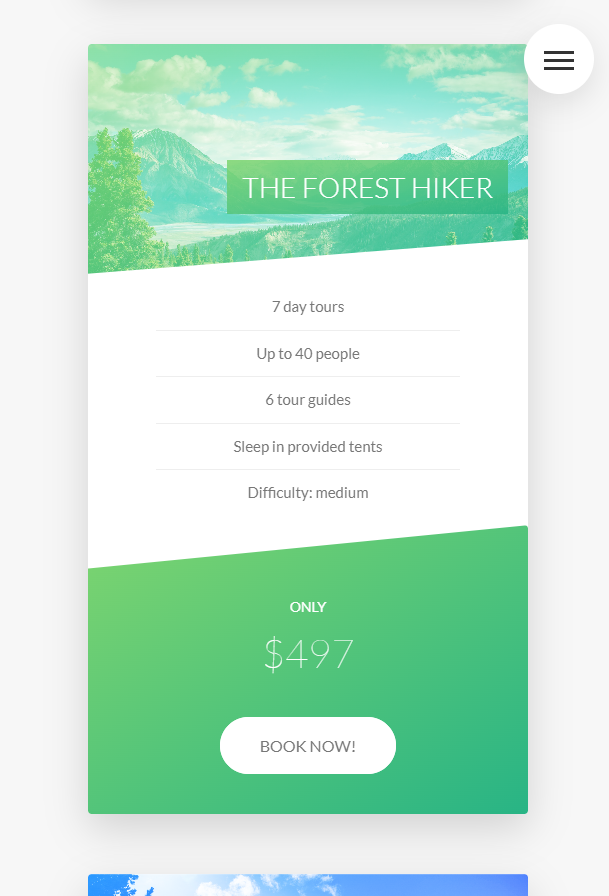
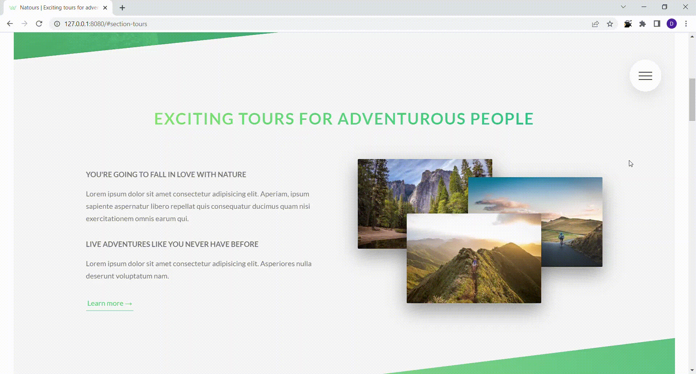
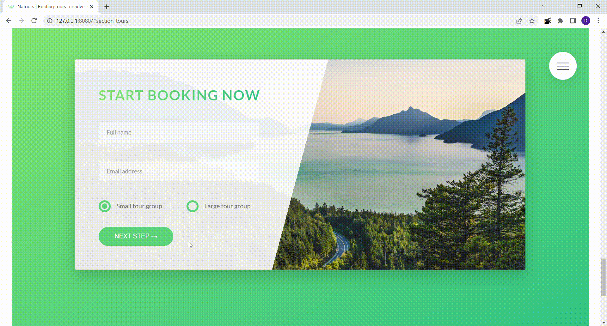

  

  

# Natours

> Natours is a responsive site with advanced CSS Features, some of which replace Javascript!
 
  
**Live site**: <https://nature-tour.netlify.app/>

### Used technologies

- SASS
- HTML5
- PostCSS
- BEM metodology
- npm scripts
- icon-fonts
- Art direction & density switching and Density & resolution switching methods

### Structure

## Table of Contents

- [Introduction](#natours)
  - [Live site](#natours)
  - [Used technologies](#used-technologies)
  - [Project Structure](#structure)
- [Overview](#overview)
  - [More about technologies](#more-about-technologies)
  - [Realized Features](#realized-features)
- [Setup](#quick-setup)
- [Contacts](#contacts)
 
  
## Overview

### More about technologies

1.  I used BEM(Block-Element-Modifier) metodology

        

          <h1 class="heading-primary">
            Outdoors
            is where life happens
          </h1>

          <a href="#section-tours" class="btn btn--white btn--animated"
          >Discover our tours</a>
        

2.  There were used different options of Sass: mixins, nesting, variables.

        @mixin respond($breakpoint) {
            @if $breakpoint == phone {
                @media only screen and (max-width: 37.5em) { @content };     //600px
            }
            @if $breakpoint == tab-port {
                @media only screen and (max-width: 56.25em) { @content };     //900px
            }
            @if $breakpoint == tab-land {
                @media only screen and (max-width: 75em) { @content };    //1200px
            }
            @if $breakpoint == big-desktop {
                @media only screen and (min-width: 112.5em) { @content };    //1800
            }
        }

        &__logo-box {
            text-align: center;
            margin-bottom: 8rem;

            @include respond(tab-port) {
            margin-bottom: 6rem;
            }
        }

3.  Created site for various devices.

|                Desktop                 |                Mobile                 |
| :------------------------------------: | :-----------------------------------: |
|  |  |

0 - 600px: Phone

600 - 900px: Tablet portrait

900 - 1200px: Tablet landscape

[1200 - 1800] is where our normal styles apply

1800px + : Big desktop
 

4.  Cross-browser support was achieved thanks to PostCSS and `@supports`.

        @supports (-webkit-backdrop-filter: blur(10px)) or (backdrop-filter: blur(10px)) {
            -webkit-backdrop-filter: blur(10px);
            backdrop-filter: blur(10px);
            background-color: rgba($color-black, .3);
        }

5.  For adding responsive images were used Art direction & density switching and Density & resolution switching methods.

        <picture class="footer__logo">
          <source
            srcset="
              img/logo-green-small-1x.png 1x,
              img/logo-green-small-2x.png 2x
            "
            media="(max-width: 37.5em)" />
          
        </picture>

            

### Realized features

1. Openning and closing navigation with checkbox. Animations. Filling links with color from left to right, when they are hover.

>Open/close navigation

    &__checkbox:checked ~ &__background {
        transform: scale(80);
    }

    &__checkbox:checked ~ &__nav {
        opacity: 1;
        width: 100%;
    }

>Filling links with color

    &__link {
        &:link,
        &:visited {
        display: inline-block;
        font-size: 3rem;
        font-weight: 300;
        padding: 1rem 2rem;
        color: $color-white;
        text-decoration: none;
        text-transform: uppercase;
        background-image: linear-gradient(120deg, transparent 0%, transparent 50%, $color-white 50%);
        background-size: 220%;
        transition: all .4s;

              span {
                  margin-right: 1.5rem;
                  display: inline-block;
              }
          }

        &:hover,
        &:active {
            background-position: 100%;
            color: $color-primary;
            transform: translateX(1rem);
        }
    }
 

2. Showing the back side of the cards. Opening and closing popup(when URL was changed).

>Perspetive property + created blocks for front and back side

    &:hover &__side--front {
        transform: rotateY(-180deg);
    }

    &:hover &__side--back {
        transform: rotateY(0);
    }

   
3. Effect was achieved by properties(position: absolute, outline and z-index)

4. Background video + appearance and disappearance of text in the picture(implemented with opasity and translate) + modern css property(clip-path).

5. Form features like replacing html radio buttons, changing style of active input and show placeholder during typing.

    &__input:placeholder-shown + &__label {
      opacity: 0;
      visibility: hidden;
      transform: translateY(-4rem);
    }

>Initial HTML-buttons - display:none. They were changed on new buttons and was implementing turning effect:

    &__radio-input:checked ~ &__radio-label &__radio-button::after {
        opacity: 1;
    }

## 🚀Quick Setup

1.  Clone this repository:

        git clone https://github.com/DmitriZaytsev/NatureTrips.git

2.  Install npm packages:

        npm i

3.  Open site in browser:

        npm run start

You can replace "npm" with the word "yarn", if you use it.

---

### 💌Contacts

Telegram: [@dmitr1_zaytsev](https://t.me/dmitr1_zaytsev)

Mail: <dmitri_zaytsev@bk.ru>
